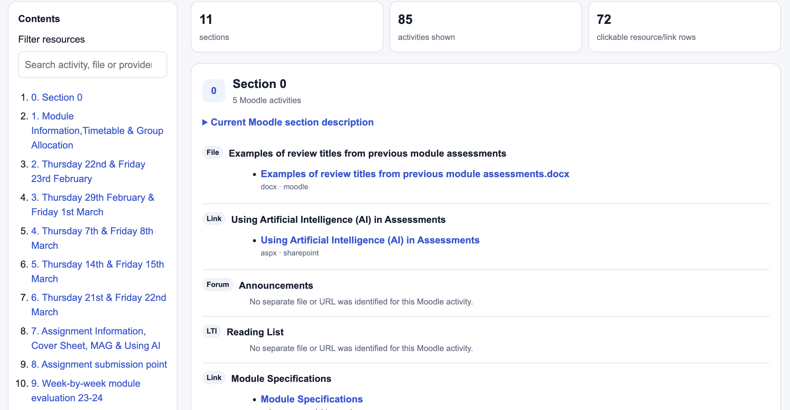

# Moodle Course Content Mapper

Create an interactive, browsable and editable representation of an existing Moodle course from the processed outputs of [Moodle Course Auditor](https://github.com/cloudpedagogy/cloudpedagogy-moodle-course-auditor).

Moodle Course Content Mapper preserves the current Moodle section and activity structure and connects activities to extracted course resources. Its **primary output is an interactive HTML course map** for exploring the existing course, with navigation, filtering and clickable links to mapped resources.

It also generates an **editable Microsoft Word version** of the map for human-led course review and redesign. In Word, headings, activities, explanatory text and linked resource references can be moved, renamed, annotated and reorganised to sketch a proposed new structure while retaining links back to the source resources.

The mapper is intentionally conservative: it represents what is present in the source course and avoids automatically deciding how the course should be redesigned.

## Example course map



*Example of the primary HTML output generated from a Moodle course. The map represents the current Moodle structure and provides interactive navigation, filtering and clickable links to mapped course resources.*

## Where the data comes from

Moodle Course Content Mapper is a **downstream companion tool** to [CloudPedagogy Moodle Course Auditor](https://github.com/cloudpedagogy/cloudpedagogy-moodle-course-auditor).

Moodle Course Auditor analyses Moodle backup (`.mbz`) files and produces structured audit data plus extracted course resources. The analysis is **non-destructive**: it works on a static backup file and does not connect to, alter or write back to the live Moodle course.

Moodle backups are normally associated with backup and restore workflows, but they also contain a rich source of information about a course, including its sections, activities, resources, files, links, visibility, structure and other metadata. Moodle Course Auditor exposes that information in reusable CSV/JSON reports and, when file extraction is enabled, recovers the associated course resources.

The Content Mapper then uses those outputs to create a human-readable representation of the course:

```text
Live Moodle course
        ↓
Moodle backup (.mbz)
        ↓
Moodle Course Auditor
(non-destructive analysis of the static backup)
        ↓
audit/
extracted_files/
        ↓
Moodle Course Content Mapper
        ↓
index.html          → interactive view of the current course
content_map.docx    → editable working copy for redesign
content_map.csv     → structured mapping data
mapping_report.md   → QA and provenance
```

This separation is deliberate:

- **Moodle Course Auditor** answers: *What is in this Moodle backup?*
- **Moodle Course Content Mapper** answers: *How can that existing course structure and its resources be presented clearly for review and redesign?*

## Course review and redesign

The mapper is designed to provide a bridge between **Moodle course audit**
and **human-led course redesign**.

``` text
Existing Moodle course
        ↓
Moodle Course Audit
        ↓
Evidence about structure + extracted resources
        ↓
Moodle Course Content Mapper
        ↓
Interactive HTML map of the current course
        ↓
Editable Word redesign workspace
        ↓
Human-reviewed proposed course structure
```

The HTML output provides a clear view of the **current Moodle course**:
sections, activities and associated resources can be explored without
changing Moodle itself. This makes it useful for understanding what is
currently present before redesign decisions are made.

The Word output supports the next stage. Because it is editable, academics
and learning designers can rearrange headings, activities, explanatory
text and linked resources to explore alternative structures. The links to
the bundled source files remain available as reference points during that
process.

The tool therefore **supports course redesign; it does not automatically
redesign the course**. Pedagogical interpretation and decisions remain
with the course team.

## Features

-   Preserves Moodle section order and activity order.
-   Uses existing Moodle labels as subheadings.
-   Maps resources and URLs to Moodle activities.
-   Creates clickable links to extracted PDFs, Word files, spreadsheets
    and other resources.
-   Creates an editable Microsoft Word working copy for course review
    and redesign.
-   Creates a browsable HTML course map.
-   Supports a portable bundle containing copied resources.
-   Uses conservative filename matching and reports ambiguous or
    unresolved items rather than guessing.
-   Can optionally include hidden Moodle content.

## Requirements

-   Python 3
-   `python-docx`
-   A processed Moodle Course Audit course folder containing `audit/`
    and `extracted_files/`

## Installation

Clone or download the repository, then from the repository root create a
virtual environment:

``` bash
python3 -m venv .venv
source .venv/bin/activate
```

Install dependencies:

``` bash
python3 -m pip install -r requirements.txt
```

## Input structure

Place the complete processed course folder inside `input/`.

Example:

``` text
input/
└── literature-review/
    ├── audit/
    │   ├── sections.csv
    │   ├── activities.csv
    │   ├── content_placement_inventory.csv
    │   └── ...
    └── extracted_files/
        ├── files_by_moodle_context/
        ├── resource_bundle/
        ├── resource_bundle_by_type/
        ├── resource_manifest.csv
        └── ...
```

Do not manually reorganise the `audit/` or `extracted_files/` folders
before mapping.

## Usage

Basic mapping:

``` bash
python3 content_mapper.py input/literature-review
```

Recommended portable mapping:

``` bash
python3 content_mapper.py input/literature-review --bundle
```

The `--bundle` option copies linked extracted resources into the output
`resources/` directory. This is recommended when the HTML/Word map will
be moved or shared together with its resources.

Other options:

``` bash
python3 content_mapper.py input/literature-review --include-hidden
python3 content_mapper.py input/literature-review --title "Reviewing the Literature"
python3 content_mapper.py input/literature-review --output-dir output/custom-name
python3 content_mapper.py --help
```

## Outputs

A typical bundled output is:

``` text
output/
└── literature-review/
    ├── index.html
    ├── content_map.docx
    ├── content_map.csv
    ├── mapping_report.md
    ├── unresolved_items.csv
    └── resources/
```

### `index.html` — primary interactive output

The main output of the mapper. It provides an interactive, browsable
representation of the **current Moodle course structure**, including its
sections, activities and mapped resources.

The HTML interface includes course navigation and resource filtering, and
mapped local resources and external URLs are clickable. When `--bundle`
is used, links to local files point to the portable copies in
`resources/`.

This output is intended primarily for exploring and reviewing the
existing course before or during redesign.

### `content_map.docx` — editable redesign workspace

Editable Microsoft Word representation of the course map for the next
stage of review and redesign.

Unlike the HTML map, which is primarily for exploring the current course,
the Word version can be actively rearranged. Course teams can move and
rename headings, activities and explanatory text; move linked resource
references into a proposed new sequence; add notes; and use the document
as a working outline for a redesigned course.

Clickable links to the underlying bundled resources are retained, so a
reviewer can continue opening the relevant PDFs, Word documents,
spreadsheets and other mapped resources while developing the proposed
structure.

### `content_map.csv`

Machine-readable mapping of the course structure and resources for
further analysis.

### `mapping_report.md`

QA and provenance report summarising the mapping process and
resource-link resolution.

### `unresolved_items.csv`

Items that could not be linked reliably. These are surfaced for review
rather than guessed.

### `resources/`

Created when `--bundle` is used. Contains portable copies of the linked
extracted resources.

## Resource matching

Resource resolution follows an accuracy-first sequence:

1.  Exact filename match.
2.  Case-insensitive exact filename match.
3.  Conservative normalised filename match.
4.  Very-high-confidence fuzzy filename match using the same file
    extension.

Ambiguous matches are deliberately left unresolved.

## Design principle

The mapper separates **evidence mapping** from **pedagogical redesign**.

It answers:

> What is in the Moodle course, where is it currently located, and which
> resources belong to it?

It does not currently answer:

> Where should this content move under a particular pedagogical model?

The Word working copy provides a bridge to that next stage by giving
academics and learning designers an editable representation that can be
manually reorganised without changing the source Moodle backup or
extracted resources.

## Recommended workflow

1.  Back up the Moodle course as `.mbz`.
2.  Process the backup using Moodle Course Audit with resource
    extraction enabled.
3.  Copy the resulting processed course folder into `input/`.
4.  Run Moodle Course Content Mapper with `--bundle`.
5.  Review `mapping_report.md` and `unresolved_items.csv`.
6.  Browse the source structure in `index.html`.
7.  Use `content_map.docx` as an editable working document for course
    review or restructuring.

See [INSTRUCTIONS.md](INSTRUCTIONS.md) for the step-by-step operational
workflow.

## Status

Early development / experimental.

The current focus is reliable structural mapping, resource linking and
editable course-review outputs. Future development may introduce
configurable redesign templates or pedagogical mapping while retaining
the original Moodle structure as source evidence.

## Licence

MIT
